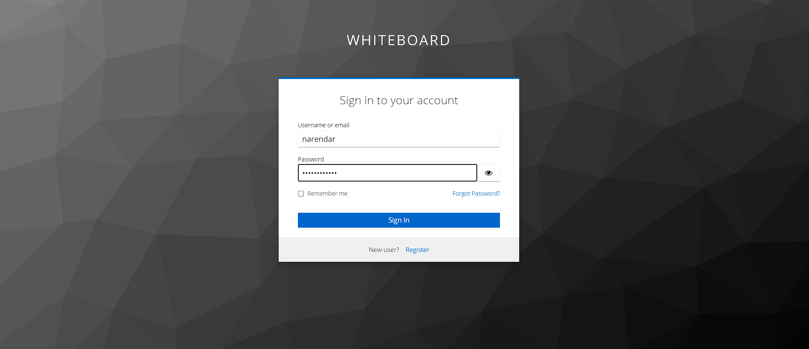
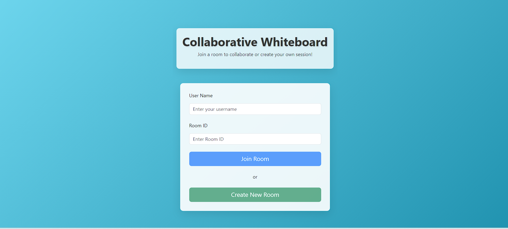
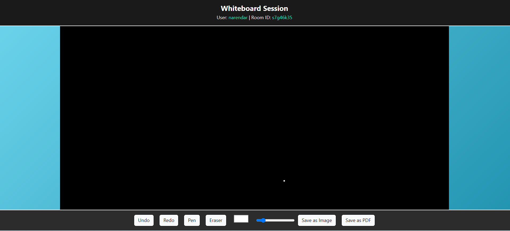

---

# Real-Time Collaborative Whiteboard

## Overview

The Real-Time Collaborative Whiteboard is a web application designed for seamless collaboration among multiple users. This application allows users to draw, upload images, and interact with a shared whiteboard in real-time. With advanced features like machine learning predictions, undo/redo actions, and secure authentication, this whiteboard is perfect for both educational and professional environments.

### Key Features
- **Real-Time Collaboration**: Multiple users can interact with the whiteboard simultaneously, with live cursor tracking.
- **Image Uploads**: Users can upload images to the whiteboard for annotation or reference.
- **Drawing Tools**: A variety of drawing tools are available, allowing for freehand drawing, shapes, and text.
- **Machine Learning Predictions**: The whiteboard can make real-time predictions based on user input, enhancing the collaborative experience.
- **Undo/Redo Actions**: Users can easily undo or redo actions, making the whiteboard flexible for complex tasks.
- **Content Saving**: Save the whiteboard content locally or to the cloud for future reference.
- **Secure Authentication**: Integrated with Keycloak, the application ensures that only authorized users can access the whiteboard.
- **Responsive Design**: The whiteboard is fully responsive, ensuring a smooth experience across all devices.
- **Professional UX**: Built with Bootstrap 5, the application offers a clean, user-friendly interface.

### Technologies Used
- **Frontend**: React, TypeScript, Bootstrap 5
- **Backend**: Node.js, Express.js
- **Authentication**: Keycloak
- **Deployment**: Vercel

## Screenshots


*Caption: The login using keycloak interface of the Real-Time Collaborative Whiteboard.*


*Caption: Real-time collaboration with multiple users interacting on the whiteboard.*


*Caption: Home page for the whiteboard.*


*Caption: Real-time collaboration with multiple users interacting on the whiteboard.*

## Setup and Installation

1. **Clone the repository**:
   ```bash
   git clone https://github.com/yourusername/real-time-collaborative-whiteboard.git
   ```
2. **Install dependencies**:
   ```bash
   cd real-time-collaborative-whiteboard
   npm install
   ```
3. **Start the development server**:
   ```bash
   npm start
   ```
4. **Access the application**:
   Open `http://localhost:3000` in your web browser.

## Deployment

The project is deployed on Vercel. You can access the live application [here](https://your-vercel-url.vercel.app).


---

